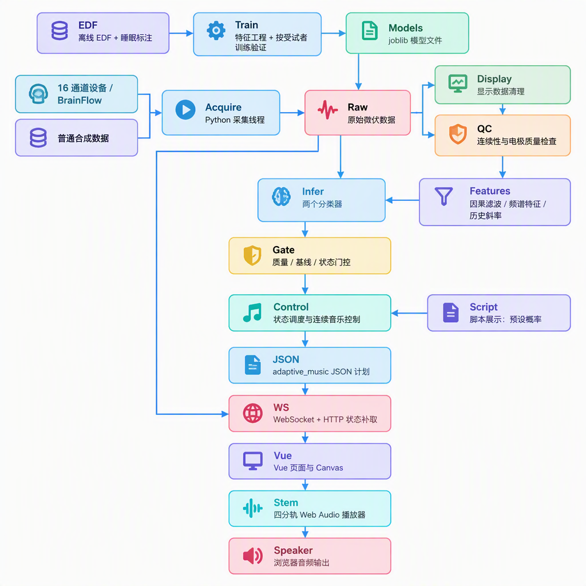

# 

# Terry EEG：项目架构、数据流与算法详解


> 代码基准：Git `ca590ab`，静态核对日期：2026\-09\-19。本文面向希望理解、演示和继续开发项目的读者。描述的是当前源码，不等于本次已完成设备联调、模型复评或实际音频验证。本次没有运行测试、构建或启动采集。
> 
> 
> 
> 本文架构范围已按功能边界调整：自适应音频主路线为已对齐的四分轨混音；上传 WAV 仅列为普通播放辅助功能。此为文档范围修正，不表示源码中的独立 MIDI 叠加实验已被删除。
> 
> 
> 
> 

\> **核心定位：16 通道脑电入眠分析与自适应音乐研究原型。** 分类器输出 W/N1/N2 概率与未来首次稳定 N2 概率；规则控制器把这些结果转成音乐参数；浏览器负责实际播放。默认动态展示使用预设概率，不能当作分类效果演示。


## 目录


1. \[当前版本与系统边界\]\(\#1\-当前版本与系统边界\)

2. \[整体架构与技术栈\]\(\#2\-整体架构与技术栈\)

3. \[前端页面与实时通信\]\(\#3\-前端页面与实时通信\)

4. \[采集、时间与通道质量\]\(\#4\-采集时间与通道质量\)

5. \[预处理与特征工程\]\(\#5\-预处理与特征工程\)

6. \[离线数据、标签与模型训练\]\(\#6\-离线数据标签与模型训练\)

7. \[在线推理与基线门控\]\(\#7\-在线推理与基线门控\)

8. \[脑电到音乐的控制算法\]\(\#8\-脑电到音乐的控制算法\)

9. \[分轨自适应播放与上传功能边界\]\(\#9\-分轨自适应播放与上传功能边界\)

10. \[接口与模块导航\]\(\#10\-接口与模块导航\)

11. \[部署、局限与后续验证\]\(\#11\-部署局限与后续验证\)

12. \[配图说明\]\(\#12\-配图说明\)

## 1\. 当前版本与系统边界


### 1\.1 系统回答什么问题


- 当前更接近清醒 W、入睡过渡 N1，还是浅睡 N2？

- 当前之后 300 秒内，是否会首次进入持续至少 60 秒的稳定 N2？

- 怎样把状态概率与频谱变化转为平缓、可停止的音乐调整？

这三个问题分别对应**\*\*状态分类、未来事件预测、规则音乐控制\*\***。音乐控制不是第三个训练出的神经网络，也不是让大语言模型直接读取实时脑电。


### 1\.2 新版主要入口


当前 `frontEnd/src/App.vue` 默认选择 `stems` 音乐源、`Track00008` 素材，并默认使用 `demo + showcase`。主页面的两个音乐来源是：


|来源|实际操作|是否修改 MIDI|
|---|---|---|
|BabySlakh 四分轨|同步播放四个原始 WAV，改变声部比例和低通亮度|否；这条路径不读取或重写 MIDI|
|上传 WAV|普通完整音频播放与音量管理，不纳入自适应修改路线|当前无法用 MIDI 算法修改原曲内部音符|


本文主要架构聚焦四分轨自适应控制；上传仅作为辅助播放功能。源码仍存在独立音符叠加实验，既不等同于修改原曲，也不计入上传音频的已实现修改能力。


后端仍保留 Suno 本地素材选曲能力、独立音乐策略及手动调试组件。它们不能全部视为当前主页面默认执行的流程。历史 README 中的五模式音乐策略，也不应直接等同于当前 Web 的 M1/M2/M3 调度。


### 1\.3 三种输入模式


|模式|数据|是否运行模型|音乐依据|
|---|---|---|---|
|`demo + showcase`|合成波形|否|每 24 秒切换的预设 W/N1/N2 概率|
|`demo + model`|合成波形|是，需本地模型|模型输出、质量与基线门控；不代表真实睡眠|
|`brainflow`|设备返回的 16 通道脑电|满足条件时运行|真实输入的模型概率与特征；有效性仍需验证|


脚本展示阶段为 W→N1→N2→W，96 秒循环。跨循环边界两个 W 段相连，会连续保持 48 秒 W。固定概率分别是 `(0.94,0.04,0.02)`、`(0.08,0.86,0.06)`、`(0.02,0.08,0.90)`。事件明确标记 `probability_origin=scripted_not_model`，不能在报告中称为模型识别结果。


## 2\. 整体架构与技术栈




### 2\.1 前端（web界面）


\- **\*\*Vue 3\.5\*\***：单文件组件、响应式状态与页面组织；不是 React。

\- **\*\*Vite 6\*\***：开发服务器和构建工具；依赖管理使用 **\*\*pnpm\*\***。

\- **\*\*Canvas\*\***：原始 EEG 波形、音频波形与频谱显示。

\- **\*\*WebSocket / Fetch\*\***：实时消息、状态补取、素材下载与上传。

\- **\*\*Web Audio API\*\***：\`AudioContext\`、音频缓冲、振荡器、增益、低通、压缩器、分析器及音频时钟调度。

- Playwright 和 Node 测试脚本存在于工程中；存在测试不代表本次已执行。

### 2\.2 后端（python服务）


\- **\*\*Python \+ FastAPI \+ Uvicorn\*\***：HTTP/WebSocket 服务。项目声明 Python ≥3\.10，启动脚本使用 uv 管理 Python 3\.12 环境。

\- **\*\*BrainFlow\*\***：Cyton Daisy WiFi 设备接入，可选硬件依赖。

\- **\*\*NumPy / SciPy\*\***：信号矩阵、因果滤波、Welch 功率谱。

\- **\*\*MNE\*\***：离线 EDF 读取、通道处理和重采样。

\- **\*\*pandas / PyArrow\*\***：特征表与中间数据。

\- **\*\*scikit\-learn / joblib\*\***：传统机器学习、标准化和模型保存。

\- **\*\*Matplotlib / Seaborn / statsmodels / YASA\*\***：分析图表、统计与纺锤波研究辅助功能，不全部进入在线分类。


前端和后端如何交互：

通过2种模式：

1\.请求接口，http接口，http协议，有两种请求的格式，post请求和get请求，当前用的最多的是post请求

2\.websocket  ws协议，建立两个长久通信的渠道，能长时间通信


### 2\.3 线程与职责


一个服务进程维护一个共享采集服务，而非为每位浏览器用户独立采集。采集线程读取数据，后台编排线程处理有界队列并执行推理，异步 Web 服务传递消息。浏览器获取音频素材后在本地播放，实时推理不等待远程音乐生成。


推理队列上限为 32 块；每个浏览器的显示队列上限为 8 条。显示队列满时会丢弃旧消息。因此实时界面不是完整无损实验记录器。


## 3\. 前端页面与实时通信


### 3\.1 组件职责


|文件|职责|
|---|---|
|`frontEnd/src/App.vue`<br>|输入模式、设备配置、音乐来源、采集开始/停止、WebSocket、状态归一化|
|`components/StemMusicPanel.vue`|分轨播放状态、声部比例、调制强度与对照混音|
|`components/AdaptiveMusicPanel.vue`|既有底轨/合成实验面板；不能编辑上传原曲音符|
|`audio/stemEngine.js`|分轨加载、同步起播、事件门控、渐变、停止|
|`audio/stemMix.js`|将后端目标转成最终前端混音参数，采样音频分析器|
|`audio/adaptiveEngine.js`|底轨循环、音符合成、调度及异常渐出|
|`audio/uploadLoudness.js`|上传音频 RMS/峰值分析与补偿|
|`audio/demoOrigin.js`|校验预设演示来源，防止混淆模型结果|


### 3\.2 开始采集的时序


```Plain Text
sequenceDiagram
    actor User as 用户
    participant UI as Vue 页面
    participant Audio as 浏览器音频引擎
    participant API as FastAPI
    participant Worker as 后台采集与编排
    User->>UI: 选模式/音乐并点击开始
    UI->>Audio: 同步 arm / resume 获取声音授权
    UI->>API: POST acquisition/start
    API->>Worker: 创建采集与编排会话
    Audio->>API: 下载选定本地 WAV
    Worker-->>UI: samples / status
    Worker-->>UI: adaptive_music 计划
    UI->>Audio: 校验来源、序号、时间、质量
    Audio->>Audio: 缓冲完成 + 合法计划后调度播放
    loop 状态补取
        UI->>API: 每约 3 秒 GET adaptive/status
        API-->>UI: 最新计划
    end
    User->>UI: 停止
    UI->>Audio: 停止音源
    UI->>API: POST acquisition/stop
```


浏览器通常要求在用户手势内解锁声音，因此 `arm()` 在等待网络响应之前调用；接口启动成功不自动等于声音已获授权。


### 3\.3 事件字段与新鲜度


- `session_id`：采集会话；跨会话旧计划不能接续。

- `sequence`：同一会话的递增序号，用于过滤重复或过时事件。

- `timestamp_s`：后端原始事件中通常为 EEG 累计时间；不是 Unix 时间。

- `emitted_at_s`：服务器实际发出时间，播放器据此判断新鲜度。

- `playback_mode`：`adaptive`、`conservative`、`demo_scripted` 或静音状态。

- `state`、`probabilities`、`channel_repair`：推理与质量依据。

- `stem_mix` 或 `notes/gains/waveform`：音乐控制计划。

App 会对合成播放器消息做归一化，保留 EEG 时间并把发出时间用于播放校验，也将音色参数放入 `waveform_parameters`，避免与振荡器波形名称混淆。


播放器一般拒绝落后超过 15 秒或领先超过 5 秒的 ready 计划。HTTP 补取与 WebSocket 共享序号去重，不会因重复获取而重新播放一遍。


### 3\.4 看见波形意味着什么


EEG Canvas 展示的是带显示处理的原始微伏波形，不是模型滤波后的特征输入。显示路径可去均值、裁剪和替换非有限值，不能据波形“看起来正常”判断电极质量。


分轨音频可视化来自 `AnalyserNode` 的真实浏览器输出节点采样，计算 RMS 和峰值；它证明的是节点存在数字信号，不是扬声器实际声压或人体反应。


## 4\. 采集、时间与通道质量


### 4\.1 两套通道配置必须区分


`config.yaml` 是科学分析默认通道配置；`config.hardware.yaml` 是当前硬件帽位配置。两者区域名称类似，但电极集合不同，模型不能直接混用。


当前硬件 CH0–CH15 顺序：


**\*\*C3、C4、Cz、FC3、FC4、CP3、CP4、FCz、CPz、Fz、P3、Pz、P4、O1、Oz、O2。\*\***


|区域|硬件配置中的通道|
|---|---|
|额区|Fz、FC3、FCz、FC4|
|中央区|C3、Cz、C4、CP3、CPz、CP4|
|枕顶区|P3、Pz、P4、O1、Oz、O2|


LIVE 模式要求操作者确认物理接线，并设置 `TERRY_EEG_CHANNEL_MAP_CONFIRMED=1`。程序检查配置顺序，但无法自动识别帽上的真实电极位置。


### 4\.2 采样和连续性


设备采用 BrainFlow 的 \`CYTON\_DAISY\_WIFI\_BOARD\`。采集请求可选 250/500/1000 Hz，但**\*\*当前 Web 自适应推理仅支持 250 Hz\*\***；其他采样率可用于采集显示，不会自动重采样后推理。


- 单输入块允许 1–2500 个样本。

- `start_sample` 必须连续。

- LIVE 包计数器必须为 0–255 整数，并按模 256 每次加 1。

- 接收时间戳允许重复或非均匀间隔，拒绝倒退和超过 2 秒的跳变。

- 首数据等待 30 秒、块间接收间隔 2 秒、队列积压 3 秒及队列溢出等有独立保护。

- 设备读取另有连续 10 秒无数据失败条件。

这些阈值服务于不同层，不能合并成一个“系统超时”。设备时间戳主要是接收时间，不能替代独立 ADC 时钟测量或 EEG—音频硬件同步。


### 4\.3 原始通道检查与实验性补全


Web 通常累计至少 6 秒原始样本再检查通道。检查包含非有限值、去趋势后的 1%–99% 幅度范围、标准差、平直比例及伪迹比例。主要阈值包括 500 µV 幅度范围、0\.1 µV 标准差下限、80% 平直比例和 2% 大幅偏离比例。


|检查结果|行为|
|---|---|
|至少 8/16 通道有效|用有效通道逐采样均值补全无效通道，允许继续实验性推理|
|1–7 通道有效|分类暂停；若存在可用音乐素材，允许固定低增益保守播放|
|0 通道有效|冻结并静音|


均值补全不是恢复真实空间脑电。区域特征尽量排除合成通道，整个区域缺失时采用全局有效通道回退，这进一步削弱脑区解释的可靠性。


坏窗口后恢复时重建滤波、历史、基线和音乐状态，不把间断数据直接拼接成连续生理过程。模型权重可继续复用。


## 5\. 预处理与特征工程


### 5\.1 信号预处理


在 `preprocess.py` 与流式模块中，核心流程是：


1. 统一为 16 通道并检查输入。

2. 将 µV 转成 V；功率因此以 V² 为基础。

3. 平均参考：每个时间点减去通道平均。

4. 四阶 Butterworth、0\.3–45 Hz 因果带通。

5. 在线用 `sosfilt` 保存滤波器状态，避免每块重新开始。

6. 形成 6 秒分析窗，步长 3 秒，即 50% 重叠。

250 Hz 下每窗 1500 样本，每步 750 样本。实时路径不重采样。离线 MNE 可先重采样整段，因此“使用相同频段”不等于离线和在线逐样本完全等价。


配置中的 `line_frequency=60` 不意味着已实现陷波；当前这条预处理没有显式 notch。`robust_rms_z_threshold` 也不能作为已执行的质量规则来介绍。当前没有 ICA 去伪迹步骤。


### 5\.2 Welch 功率谱


每个 6 秒窗口内用 Hann 窗估计 Welch 功率谱：子窗 2 秒（500 点），重叠 1 秒（250 点），去常量趋势，频率间隔约 0\.5 Hz。


频带功率通过频谱的梯形积分获得：


$\begin{aligned}
P_b &= \int_{f\in b}PSD(f)\,df, \\
\ell_b &= \log_{10}(P_b+\epsilon)
\end{aligned}$


|频带|范围|
|---|---|
|delta|0\.5–4 Hz|
|theta|4–8 Hz|
|alpha|8–12 Hz|
|sigma|12–16 Hz|
|beta|13–30 Hz|
|high\-beta|20–30 Hz|


频带选取通常包含下界、不含上界；相对功率分母使用 0\.5–30 Hz 范围。sigma 与 beta 有重叠，因此不能简单把六个频带相加视为总功率。


区域特征是**\*\*逐通道 log 功率的均值\*\***，不是先求通道绝对功率均值再取 log。


### 5\.3 可解释特征与真正的模型输入


核心解释量包含额区 beta/high\-beta、枕顶 alpha、中央 theta/sigma、额中央 delta，以及 alpha/theta log 比值。


特别注意，`posterior_alpha_theta_log_ratio` 实际为：


$\begin{aligned}
\text{posterior alpha log power}-\text{central theta log power}
\end{aligned}$


分子和分母来自不同区域，不能写成同一枕区的 alpha/theta 比。


部署的未来 N2 模型使用 11 维输入：


|类型|特征名|
|---|---|
|六个频谱量|`frontal_beta_log`、`posterior_alpha_log`、`central_theta_log`、`central_sigma_log`、`frontocentral_delta_log`、`posterior_alpha_theta_log_ratio`|
|四个变化率|上述 beta、alpha、theta、alpha/theta 的 `_slope_1m`|
|一个质量量|`signal_quality`|


状态模型静态版本为六个频谱量加质量共 7 维；动态版本增加四个斜率，共 11 维。运行时按模型包内 `features` 的顺序组装向量，不能随意调整列顺序。


斜率只使用过去最多 20 个窗口，窗口终点跨度为 57 秒，至少需要 3 个有限值，单位是每分钟变化率。


逐通道功率、相对功率、high\-beta、基线 z 分数、EOG/EMG 和纺锤波事件，并不都进入部署分类器。纺锤波检测主要用于离线描述性分析，不是当前未来 N2 模型的输入。


### 5\.4 滤波后质量


基础窗口质量检查包括通道峰峰值 ≤500 µV、标准差 ≥0\.1 µV。基础配置要求有效比例 ≥0\.75，即 16 通道中至少 12 个。当前 Web 配合显式通道补全将最低比例覆盖为 0\.5，即至少 8 个。


原始通道修复检查和滤波后窗口质量是两个步骤；通过第一步不自动保证第二步通过。


## 6\. 离线数据、标签与模型训练


### 6\.1 数据组织与标签


`io.py` 查找 `EPCTL` 加数字命名的受试者目录，读取排序后的 EDF、阶段 TXT 和可选伪迹 MAT。阶段标签经过别名归一化，时间包含格式与跨午夜处理启发式；这不是已经验证的 EDF 时钟自动对齐。


“首次稳定 N2”定义为首次连续至少 60 秒 N2，相邻片段允许约 1 秒连接容差；起点取该持续段最初开始时刻。稳定性要通过后续标签回顾确认，不能在起点瞬间直接观察到“已经持续 60 秒”。


支持 N2 前 20 分钟到后 10 分钟的分析片段，以及从记录起点到 N2 后 10 分钟的 `record_start` 设置。两者锚点不同，不能混淆提前预测结果。


未来事件标签按 6 秒窗的**\*\*中点\*\***计算：


$\begin{aligned}
y=1\quad\text{当}\quad0<t_{N2}-t_{mid}\le300\ \text{秒}
\end{aligned}$


训练未来预测只保留 N2 前窗口，排除起点之后的样本。运行时结果通常以窗口终点表示，两者有 3 秒差异；靠近起点的窗口还可能覆盖起点后的样本，应在严格评估中单独检查。


### 6\.2 两个学习任务


```Plain Text
flowchart LR
    Data[EDF 与标签] --> Prep[选通道 / 预处理 / 6秒窗]
    Prep --> Table[区域频谱 + 历史斜率 + 质量]
    Table --> Future[稳定N2前窗口：未来300秒二分类]
    Table --> Stage[30秒聚合：W/N1/N2三分类]
    Future --> CV[按受试者留一验证]
    Stage --> CV
    CV --> Fit[最终选定模型重新拟合]
    Fit --> Bundle[模型 / 特征顺序 / 目标 / 类别元数据]
```


**\*\*任务 A：未来 N2 二分类。\*\*** 当前部署使用 \`future\_n2\_logistic\_continuous\.joblib\`。核心模型是标准化后的 Logistic Regression（逻辑回归），比较实验还包括随机森林和线性支持向量机。


逻辑回归可以写为：


$\begin{aligned}
\hat p &= \frac{1}{1+e^{-(w^Tz+b)}}, \\
z_j &= \frac{x_j-\mu_j}{\sigma_j}
\end{aligned}$


这里的均值和标准差应只在当前训练折中拟合，测试受试者不参与拟合。


**\*\*任务 B：W/N1/N2 三分类。\*\*** 当前部署使用 \`sleep\_state\_logistic\_30s\.joblib\`，提供三类概率，而非完整五阶段睡眠分期。没有 N3、REM 输出。


离线状态训练按窗口中点所在的 30 秒 epoch 分组，要求干净窗口比例至少 80%，对干净特征求均值，以组内阶段多数标签为目标。边缘不完整 epoch 也可能被保留。


### 6\.3 训练与验证策略


- 使用受试者留一法（LOSO）：每次留出一个完整受试者，其余受试者训练。

- 不随机拆分高度重叠窗口，避免同一人的相邻窗口同时进入训练和测试。

- Logistic Regression：平衡类权重，最大迭代 2000 次，使用标准化。

- 随机森林：300 棵树；未来预测叶节点下限 10，状态任务为 5；使用平衡权重。

- LinearSVC：标准化和平衡权重，用于比较。

- 部分未来预测流程会跳过只有单一类别的留出受试者，解释样本覆盖时必须说明。

- 状态最终模型固定选择动态逻辑回归，不是代码自动从所有实验中挑出最优模型。

未来任务还比较仅时间、真实阶段参照、静态/动态 EEG、EEG\+时间等方案。使用真实睡眠阶段的参照模型在实时环境不可获得，只能作为离线比较。


### 6\.4 指标如何解读


未来预测输出 AUC、平衡准确率、敏感度、特异度、F1；状态分类输出平衡准确率、Macro\-F1、Cohen's Kappa 和各类召回率。部分状态统计使用 5000 次受试者级 bootstrap。


受试者平均 AUC 与合并所有窗口后计算的 AUC 不是同一个统计量。代码中的部分 AUC 区间采用均值 ±1\.96×标准误，也不等于所有场景都用了 bootstrap。


持续预警判定以概率 ≥0\.5 连续 10 行代表约 30 秒。但筛除坏窗口后，相邻行可能不再时间连续；首次满足段的起始时刻与最终确认时刻也相差约 27 秒。这可能影响提前量解释。


本文不重新引用 README 中的历史分数作为硬件帽位模型或新版修复路径的性能。源码存在指标计算流程不等于当前模型已获得相同分数；须核对数据、配置、模型产物和报告来源。


## 7\. 在线推理与基线门控


### 7\.1 模型加载与调用


`InferenceEngine` 读取可信的 joblib 字典，使用 `model`、`features`，状态模型还需要 `classes` 等字段。二分类通常取 `predict_proba` 的正类列，状态概率按模型类别对应输出。


joblib 不是安全的任意文件交换格式，应只加载可信文件。当前缺少完整的模型—预处理版本指纹和严格兼容性验证。用于离线比较的 LinearSVC 没有同样的 `predict_proba` 接口，不能不经适配就替换部署模型。


### 7\.2 状态积累


`RealtimeSession` 持续维护滤波状态、窗口、特征历史和状态聚合队列：


1. 输入连续样本块。

2. 每新增 750 个样本形成一次窗口更新。

3. 提取特征和斜率。

4. 判断 `invalid`、`warming` 或 `ok`。

5. 特征齐备时计算未来概率。

6. 状态聚合历史齐备时计算 W/N1/N2。

理论上未来概率约 12 秒开始具备斜率输入；现代 30 秒状态模型需要约 10 个窗口，首次状态约 33 秒。Web 额外按至少 6 秒批处理，实际交付可能更晚。


### 7\.3 300 秒稳健基线


每个核心解释特征使用干净数据中位数和 MAD 尺度：


$\begin{aligned}
z=\frac{x-\operatorname{median}(x)}{1.4826\operatorname{MAD}(x)}
\end{aligned}$


MAD 不可用时尝试标准差。每个量至少需要 3 个有限值，所有 7 个核心量都需要有效尺度。窗口结束时间达到 300 秒后尝试冻结基线；条件不足时继续积累，所以不是“到第 300 秒保证成功”。


**\*\*基线 z 分数不是上述 11 维分类器的直接输入。\*\*** 模型可先产生概率；Web 的自适应音乐仍单独等待基线就绪。基线未完成但有有效电极和素材时，可进入保守播放。


### 7\.4 在线与离线的差异


|项目|离线状态训练|当前在线聚合|
|---|---|---|
|分组|固定 30 秒 epoch|最近约 10 个重叠窗口|
|实际信号覆盖|按中点分桶|约 33 秒原始覆盖|
|历史质量|干净比例 ≥80%，对干净特征求均值|历史中可能含过去坏窗口的有限特征|
|聚合|固定组|滚动 `nanmean`，各特征至少 3 个有限值|


这是值得后续统一的训练—部署差异。旧状态包若缺失 `aggregation_seconds`，队列可能退化为 1，却仍要求 3 个有限值，导致无状态输出；现代 30 秒模型避免了这一特定问题。


## 8\. 脑电到音乐的控制算法


### 8\.1 离散音乐状态


`MusicScheduler` 对最近 30 秒概率求平均，然后判断：


- N2 ≥0\.65：目标 M3。

- 否则 N1 ≥0\.55，或未来 N2 ≥0\.65 且中央 theta 基线 z ≥0\.5：目标 M2。

- 其他：M1。

Web 当前配置要求连续两次确认、至少 60 秒驻留，在检测到新乐句区间时应用状态切换。M1/M2/M3 是编排状态名称，不是另外三种医学分期。


### 8\.2 连续控制量


`eeg_music_modulation.py` 在离散状态之外，持续计算控制量。令：


$\begin{aligned}
P=p_W+0.45p_{N1}
\end{aligned}$


额区 beta 与中央 theta 的基线 z 有效时：


$\begin{aligned}
F &= 0.5+0.5\tanh((\beta_z-\theta_z)/3), \\
T &= 0.8P+0.2F
\end{aligned}$


缺少特征时使用 `T=P`。对 T 做 20 秒时间常数指数平滑：


$\begin{aligned}
\alpha &= 1-e^{-\Delta t/20}, \\
S_t &= S_{t-1}+\alpha(T-S_{t-1})
\end{aligned}$


截断到 `[0,1]` 后增加中间区间对比度：


$\begin{aligned}
L=0.5+\frac{0.5\tanh(2.4(S-0.5))}{\tanh(1.2)}
\end{aligned}$


L 是实验性的音乐控制量，不是经过校准的“觉醒指数”。脚本展示每次重建调制器并标记平滑为零，因此不具备普通推理模式的同等缓慢过渡逻辑。


### 8\.3 独立 MIDI 实验模块：不用于修改上传音频


以下保留为已有算法代码的说明，不属于主分轨播放路线，也不列入上传音频修改方案。MIDI 操作的是符号音符，当前没有从上传 WAV 恢复并编辑其内部音符的流程。


|参数|当前规则|
|---|---|
|密度档|`min(4, int(5L))`|
|旋律抽样步长|五档对应 `[4,3,2,1,1]`|
|目标音符时值|`0.3+3.7(1-L)` 拍，并避免越过下个起音/乐句末端|
|力度|`round(40+32L)`，偶数拍起点额外加 6|
|音区|最低两档降一个八度|
|主增益|0\.18|
|pad 增益|`0.34-0.12L`|
|melody 增益|`0.34+0.42L`；M3 为 0|
|bass 增益|`0.18+0.18L`；M3 为 0|
|texture 增益|`0.28+0.18L`；M3 为 0\.16|
|brightness|`0.08+0.67L`|
|reverb\_send|`0.35-0.25L`|
|stereo\_width|`0.25+0.5L`|


底层 `music_engine/midi.py` 使用 C 大调/A 自然小调的音级与 C–Am–F–G 和弦，默认四小节、16 拍。种子和乐句编号控制确定性的动机轮转、和弦偏移和变化；不是学习模型生成的新作曲，也不会根据上传歌曲自动识别调性。


M3 关闭旋律与低音，但 v3 编排仍保留安静的持续和声 `texture`。符号 `pad` 音符存在于计划中，当前浏览器不合成这些 pad 音符。


## 9\. 分轨自适应播放与上传功能边界


### 9\.1 BabySlakh：同步混合原始四分轨


后端 `babyslakh.py` 维护 Track00001–Track00020 的固定白名单，每首选四个非鼓 WAV。`piano/strings/bass/pad` 是控制角色，不保证源轨真实乐器就是该名称。


默认素材目录为 `assest/babyslakh_16k.tar/babyslakh_16k`，路径中的 `assest` 是当前代码实际拼写，可通过 `TERRY_BABYSLAKH_ROOT` 覆盖。下载 Git 代码不代表素材自动存在。


后端检查 WAV 头、帧数、采样率、单/双声道及四轨时长一致（约一个采样误差）。前端更严格，只接受单声道、8–600 秒、解码后时长差不超过 0\.02 秒；因此后端可用不必然代表浏览器能播放。


后端根据 L 提供基础目标：


|角色|目标增益|
|---|---|
|piano|`0.18+0.52L`|
|strings|`0.32-0.20L`|
|bass|`0.04+0.28L`|
|pad|`0.28-0.20L`|
|brightness|`0.15+0.65L`|


前端默认强度 0\.85，进一步做对比增强。令 `q=L²(3−2L)`，增强目标为：


- piano：`0.015+0.835q`；bass：`0.01+0.40q`。

- strings：`0.70−0.65q`；pad：`0.62−0.58q`。

- 实际增益：后端目标与增强目标按强度线性插值。

- 低通截止：`800+6200×brightness` 与 `550+6650q` 按强度插值。

因此页面展示的后端计划值与浏览器实际应用值可能不同，应查看 `applied` 或导出日志。


```Plain Text
flowchart LR
    A[四个对齐 WAV] --> B[各自 BufferSource / 同一音频时钟]
    B --> C[循环边界 1 秒交叉淡化]
    C --> D[四个独立声部 Gain]
    D --> E[共同低通]
    E --> F[压缩器]
    F --> G[主增益：默认 0.18，上限 0.30]
    G --> H[AnalyserNode]
    H --> I[音频输出]
```


四轨同一时刻起播，目标一般用 3 秒线性渐变。循环首尾有 1 秒交叉淡化，不是节拍对齐。对照模式把四轨设为 0\.3、低通 7200 Hz，它是“选定四轨的固定混音”，不是原曲全部声部的完整原始混音。


保守模式固定 piano 0\.12、strings 0\.08、bass 0\.02、pad 0\.10、brightness 0\.15，不做对比增强。超过 15 秒无新有效计划后用约 2 秒渐出；页面隐藏、音频上下文中断或其他播放器接管则停止。此规则与下节的 8 秒渐出不同。


### 9\.2 上传音频：仅作为普通播放辅助功能


上传的 WAV 是已混合的音频采样，不包含可直接编辑的 MIDI 音符、乐器轨或乐谱结构。当前未实现音源分离、音频转音符、原曲音符编辑及重新合成，因此**\*\*上传音频暂不纳入 MIDI 自适应修改方案\*\***。


本项目的主要自适应音乐路线聚焦第 9\.1 节的已知四分轨：声部独立且时间对齐，可以控制各声部增益与整体亮度。用户上传文件不具备这一结构，不能直接套用分轨或 MIDI 算法。


上传功能在本文中仅保留为文件接收、完整音频播放与音量管理：PCM WAV、单/双声道、8–900 秒、8–96 kHz、单文件上限 80 MB。响度补偿、循环及淡入淡出属于播放处理，不代表修改原曲旋律、节奏或配器。


```Plain Text
flowchart LR
    WAV[用户上传完整 WAV] --> Validate[格式与大小校验]
    Validate --> Decode[浏览器解码]
    Decode --> Level[音量与淡入淡出处理]
    Level --> Output[普通音频播放]
```


**\*\*源码与本次文档范围的区别：\*\*** \`ca590ab\` 的 \`AdaptiveEngine\` 仍保留独立合成音符叠加逻辑，这只是在原曲之外增加声音，不能修改上传文件内部的音符。本文移除其作为“上传音频自适应修改”的工作路线及架构连线，不将该实验逻辑列为上传功能成果；本次未删除或停用播放器中的相关代码。


### 9\.3 音频功能的共同边界


- 音量参数与压缩器不能证明耳机声压安全。

- 没有自动识别原曲调性、速度、节拍或保证和声一致。

- 浏览器音频时钟与 EEG 时间没有硬件同步。

- 服务端 `ready` 仅表示计划就绪；`planned_only=True`、`playback_started=False` 明确指出后端不证明实际发声。

- 控制目标随脑电变化，不等于已证明能改善入睡、睡眠结构或疾病症状。

## 10\. 接口与模块导航


### 10\.1 主要接口


|接口|用途|
|---|---|
|`GET /api/health`|Web 服务基本存活，不是设备/模型健康检查|
|`GET /api/status`|采集状态|
|`GET /api/adaptive/status`|最新编排事件|
|`POST /api/acquisition/start`|开始采集；请求含 mode、demo\_profile、设备参数和音乐 ID|
|`POST /api/acquisition/stop`|停止采集与编排|
|`WS /ws/waveform`<br>|`status`、`samples`、`adaptive_music` 共用通道|
|`GET /api/stem-music`|白名单分轨素材与可用性|
|`GET /api/stem-music/{track_id}/stems/{stem_id}/audio`|读取指定原始 WAV 分轨|
|`GET /api/music/choices`|本地底轨风格/数量及上传选择|
|`POST /api/music/uploads`|上传原始 PCM WAV|
|`GET /api/music/{id}/audio`|获取本地底轨或上传音频|


运行中再次请求开始会返回既有状态，不会自动热切换设备或音乐参数。`stem_track_id` 与 `uploaded_track_id` 互斥。后端选曲优先分轨，再上传，再 Suno 本地清单。


### 10\.2 建议阅读顺序


1. \[App\.vue\]\(\.\./frontEnd/src/App\.vue\)：从用户操作找到数据入口。

2. \[app\.py\]\(\.\./backEnd/app\.py\)：理解采集和传输。

3. \[adaptive\_web\.py\]\(\.\./backEnd/adaptive\_web\.py\)：理解会话、队列、门控与演示分支。

4. \[channel\_repair\.py\]\(\.\./backEnd/channel\_repair\.py\)：理解实验性坏通道处理。

5. \[streaming\.py\]\(\.\./backEnd/src/anphy\_sleep/streaming\.py\)、\[features\.py\]\(\.\./backEnd/src/anphy\_sleep/features\.py\)、\[inference\.py\]\(\.\./backEnd/src/anphy\_sleep/inference\.py\)：理解在线模型输入和输出。

6. \[io\.py\]\(\.\./backEnd/src/anphy\_sleep/io\.py\)、\[preprocess\.py\]\(\.\./backEnd/src/anphy\_sleep/preprocess\.py\)：理解离线样本来源。

7. \[modeling\.py\]\(\.\./backEnd/src/anphy\_sleep/modeling\.py\)、\[staging\.py\]\(\.\./backEnd/src/anphy\_sleep/staging\.py\)、\[transition\_prediction\.py\]\(\.\./backEnd/src/anphy\_sleep/transition\_prediction\.py\)：理解标签、训练及验证。

8. \[eeg\_music\_modulation\.py\]\(\.\./backEnd/eeg\_music\_modulation\.py\)、\[scheduler\.py\]\(\.\./backEnd/src/anphy\_sleep/music\_engine/scheduler\.py\)、\[midi\.py\]\(\.\./backEnd/src/anphy\_sleep/music\_engine/midi\.py\)：理解规则音乐控制。

9. \[babyslakh\.py\]\(\.\./backEnd/babyslakh\.py\)、\[stemEngine\.js\]\(\.\./frontEnd/src/audio/stemEngine\.js\)、\[stemMix\.js\]\(\.\./frontEnd/src/audio/stemMix\.js\)：理解主分轨路径。

10. \[adaptiveEngine\.js\]\(\.\./frontEnd/src/audio/adaptiveEngine\.js\)、\[uploadLoudness\.js\]\(\.\./frontEnd/src/audio/uploadLoudness\.js\)：核对上传播放实现及独立叠加实验的边界，不作为原曲 MIDI 修改能力。

## 11\. 部署、局限与后续验证


### 11\.1 本地运行组成


macOS 根目录 `start_all.command` 分别启动前后端。后端在 `127.0.0.1:8000`，前端在 `127.0.0.1:5173`，开发代理转发 `/api` 与 `/ws`。后端不使用自动 reload，避免文件变化触发设备服务重启。


依赖、代码、模型、原始数据和音乐素材是不同交付物。`.env`、上传/Suno 本地音乐等不会随 Git 自动分发；BabySlakh 是否安装、模型是否存在应分别检查。密钥只保存在本地环境，不应进入前端或文档。


### 11\.2 已有保护与适用范围


代码已有素材 ID 白名单、路径约束、下载大小限制、请求序号与来源校验、输入质量检查和音频失效停止。上传 Origin 检查与绑定本机地址不等于完整账户认证；当前架构适合受控本机研究原型，不宜直接作为多用户公网服务。


大音频全量解码后的内存可能远超文件大小。共享采集状态也意味着一个用户的开始/停止会影响其他客户端。


### 11\.3 后续需要验证的重点


|事项|原因|
|---|---|
|物理通道、单位、采样率和包计数|软件配置不能替代实物核对|
|离线与在线逐步一致性|重采样、聚合与质量历史处理不同|
|修复模式下独立性能评估|均值补全改变空间信息与模型输入分布|
|模型与配置版本绑定|当前缺少强制通道/预处理指纹|
|预测标签与事件提前量审查|中点/终点差异、时间缺口和确认延迟|
|外部受试者与外部设备验证|队列内 LOSO 不是外部验证|
|浏览器切后台、断连、取消下载和恢复|需要真实运行证据，而非仅静态检查|
|音频调性、听感和实际声压|数字增益不能替代听音与声学测量|
|EEG—音频时间同步|当前没有硬件同步反馈|
|音乐干预效果|需要对照实验与适当研究设计|


此外，状态对象中的部分包龄、接收秒数和 staleness 字段尚未被完整实时更新，不能仅因字段存在就当作可靠健康监控。历史缓存复用也缺少完整配置哈希，应谨慎复用跨配置特征产物。


**\*\*总结：当前系统形成了从采集、可解释频谱特征、传统机器学习到浏览器音乐控制的实现链路；默认脚本展示、真实模型推理及临床有效性属于三个不同层次，必须分别表述。\*\***


## 12\. 配图说明


上文 Mermaid 图直接表达代码关系，适合继续维护。另使用用户指定的 `script/aisaago.py` 和 `gpt-image-2` 生成两张概念配图，任务记录与提示词保存在 \[images\]\(images/\)。图片仅辅助阅读；不作为模型性能、硬件连接或真实波形证据。图中使用简短英文标签以提高可读性，中文解释以上文为准。


### 12\.1 系统架构概念图


图中的 INPUT、PYTHON BACKEND、BROWSER 分别对应输入、Python 后端和浏览器。新版图只展示脑电驱动四分轨混音，不包含用户上传音频面板、播放分支或相关文字。四个控制角色固定为 `piano`、`strings`、`bass`、`pad`，不保证源轨实际乐器与角色同名。橙色分支表示预设展示绕过分类器与基线门控；底部表示离线训练输出模型。图中文字为生成式绘图，个别小标签清晰度有限，准确名称与连接关系以正文和第 2 节 Mermaid 图为准。


### 12\.2 机器学习流程概念图


上排是离线训练，下排是在线推理；两个预测框分别表示当前 W/N1/N2 概率与未来 5 分钟首次稳定 N2。300 秒基线服务于音乐门控，不是分类器直接输入。“相同特征定义”不表示训练与在线聚合完全一致，差异见第 7\.4 节。


当前提示词：\[架构图第三版\]\(images/architecture\_v3\.prompt\.txt\)、\[机器学习图\]\(images/ml\_pipeline\.prompt\.txt\)。当前架构图任务与输出记录：\[第三版任务清单\]\(images/architecture\_v3\_task\.json\)。本次按要求从提示词中完全移除上传音频相关内容，使用 `gpt-image-2` 新生成一张架构图；正文仅引用第三版。首版及第二版图片、提示词与任务记录作为历史产物保留，不代表当前架构说明。


