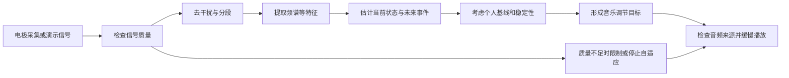

# 01｜项目全貌：从脑电到声音

[返回阅读导航](README.md) · 主要对应[原文](../Untitled.md)第 1–3 节。本文介绍**为什么分成这些模块、信息怎样流动**；不以具体程序或界面实现为中心。

## 1. 先用一句话理解这个项目

这是一个研究原型：接收人的脑电信号，估计当前处于清醒到浅睡的哪个阶段，以及近期进入稳定浅睡的可能性，再根据这些信息平缓调整正在播放的音乐。

它有三个相互独立的问题：

- **观察**：“现在的脑电像什么？”观察到的不是“睡着了”的直接证据，而是一组有噪声的电压读数。
- **估计**：“较像清醒 W、入睡过渡 N1，还是浅睡 N2？接下来约五分钟内会不会进入持续一段时间的 N2？”估计是概率，不是事实宣告。
- **调节**：“如果估计逐渐改变，音乐怎样慢慢改变，又在信号不可靠时怎样保持安全的行为？”这是音乐规则与播放控制，不是再次识别睡眠的模型。

对个体是否有效、是否改善入睡及临床效果，都需要单独的研究来证实。

## 2. 一张流程图看懂各模块

可以把各步理解为“**测量—整理—描述—估计—决策—执行**”：

1. **测量**：多个头皮电极记录不同位置的微小电位变化，采样率决定每秒记录多少次。[02](02-eeg-acquisition-signal.md)解释电极、单位和采样。
2. **整理**：识别断线、平线、异常波动和时间缺口；尽可能减少工频噪声等干扰。坏数据不能因为画出来好看就当成可靠信息。
3. **描述**：把几秒内的复杂波形压缩成频段能量、区域差异和近期变化趋势。这一步叫特征提取，不直接给出睡眠结论。
4. **估计**：根据已有标注数据学习特征与状态/未来事件的关系，给出概率。[03](03-ml-training-inference.md)解释标签、训练和概率的意义。
5. **决策**：结合个人基线、信号质量与连续几个结果，避免某次短暂波动让音乐突然改变；把目标送到[04](04-eeg-music-and-audio.md)介绍的播放器。
6. **执行与反馈**：浏览器使用已有的声音素材输出音乐。当前是“脑电影响音乐参数”的闭环；它不是根据扬声器声音或下一刻的睡眠效果实时反向优化模型。

**时间尺度不同**：电极每秒采集很多样本；每隔几秒可形成一个分析结果；分类结果和个人基线还需更长时间积累；音乐变化再做平滑处理。这些延迟有利于稳定，却会让“音乐发生变化的时刻”晚于“某段脑电出现的时刻”。

## 3. 为什么要把“当前状态”与“未来风险”分开？

当前状态是问“此刻像哪个阶段”，例如清醒的估计概率 0.70；未来风险是问“从现在往后五分钟，是否会首次出现一段连续足够久的 N2”，例如预测概率 0.60。两个数字回答不同的问题，不能相加当成一个睡眠程度。

稳定 N2 需要回头观察一段连续的标注才能确认，所以训练“未来事件”时必须清楚规定事件的起点、持续时间和预测时窗。演示时也要避免把“未来概率升高”解释成“此刻已经进入 N2”。

## 4. 演示、模型和真实采集是三种不同证据

|情境|使用什么输入|我们能据此了解什么|不能据此推断什么|
|---|---|---|---|
|动态演示|人工合成波形和预先安排的状态概率|音乐响应是否符合预设的演示步骤|模型识别是否准确|
|模型演示|合成波形送入实际预测流程|从信号处理到输出是否能贯通|合成结果能代表真实人的睡眠|
|真实设备采集|头皮电极实际记录|设备与整个链路在特定条件下的表现|未经核实就宣称准确、有效或安全|

尤其要记住：**预设概率只是演示素材**。即使画面显示 W→N1→N2、音乐同步变化，也只是控制逻辑的演示，不是模型成功识别了睡眠。

## 5. 为什么消息可以走两种通信方式？

系统一边持续收到许多采样数据，一边又有“开始、停止、查看当前情况、下载声音素材”这样的单次操作。因此可以用两类沟通方式：

- **一次请求、一次回答（HTTP）**：适合点击开始/停止、查询当前状态、获取已经存在的素材。查询“最近一个音乐方案”也可以用它，作为错过实时通知后的补取。
- **保持连接、持续通知（WebSocket）**：适合把新到的波形片段和状态变化及时送到页面。它并不需要每个采样点都重新发起一次请求。

比如 16 个通道、每通道每秒 250 次采样，理论上每秒产生 $16\times250=4000$ 个电压数值；传送时通常会把连续的一小段样本合成一条消息。这个数字说明为何需要分块传输，不代表文件大小或网络速率。实时显示在队列繁忙时可能跳过旧画面，所以画面不等于完整的原始实验记录。

消息中标记“属于哪一次采集”“是该次采集的第几次计划”，可避免重复通知或上次会话的旧计划误触发音乐。还需要区分**脑电经过了多少秒**与**服务器什么时候发送消息**：前者用于分析时序，后者用于判断播放器收到的是不是过时命令。两个时钟未做硬件同步，因此不能仅凭它们证明电极与声音精确同时发生。

## 6. “计划就绪”和“听到了声音”不是一回事

完成概率和音乐决策之后，系统只能说“已经给出播放计划”。是否真正出声，还取决于素材是否存在、音频是否解码、浏览器是否被用户授权播放、页面是否在前台、音频输出设备与音量设置等。数字音频的波形或响度读数也不能代替耳机的实际声压测量。

质量不足时应当限制自适应、使用低强度保守播放或停止，避免把无效输入当成确定的生理变化。详见[02 的质量说明](02-eeg-acquisition-signal.md)和[05 的验证边界](05-api-deployment-limitations.md)。
