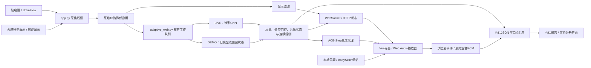
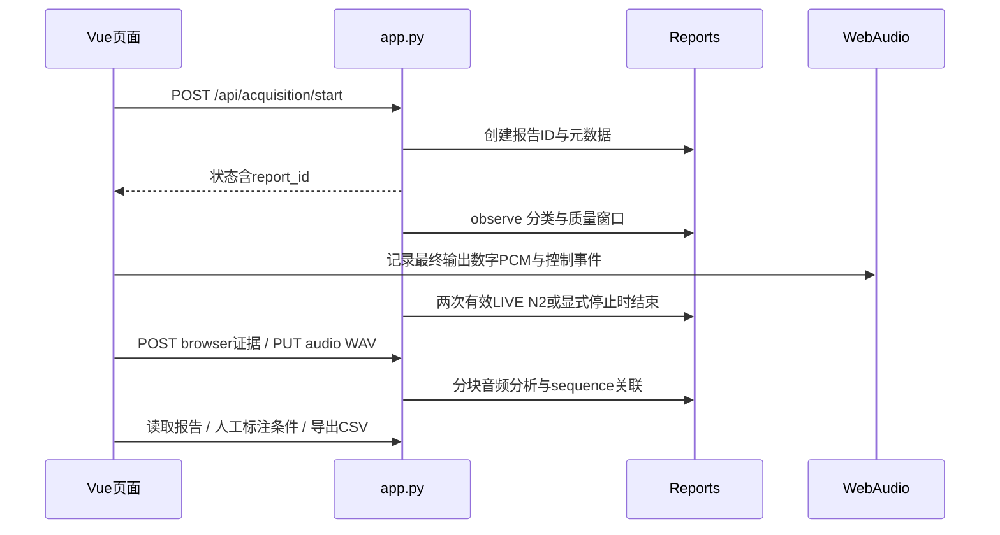

# TERRY EEG × Music：当前系统架构与功能

核查日期：2026-10-07；代码基线：Git 提交 `ace3a4e`。本文以当前 `terry/backEnd`、`terry/frontEnd` 和模型训练入口为依据，替代旧版主文档中与当前网页不一致的说明。本次为代码阅读与文档更新，没有重新执行设备采集、远端生成、盲听实验或全量测试。

## 1. 系统定位与边界

系统是一个研究性的脑电采集、睡眠阶段估计、音乐控制与数字证据记录原型。浏览器提供设备/演示选择、模型电极选择、ACE与上传背景两个音乐来源、波形显示、会话报告和实验标注；四分轨组件与API仍保留在源码，但当前App没有四分轨选择入口。本地 FastAPI 后端负责设备线程、分类线程、素材与生成代理、报告存储。真正的播放和混合发生在浏览器 Web Audio 中，而非 Python 音频接口。

- **EEG（脑电）类别**：W（清醒）、N1（睡眠阶段1）、N2（睡眠阶段2）。当前 LIVE 权重不提供 N3/REM 的有效分类保证。
- **音乐方案**：M1（清醒安定）、M2（入睡过渡）、M3（浅睡维持）。它们是音乐调度状态，不是模型新类别。
- **证据**：模型分数、代码调度事件、数字 PCM 录音及风险指标。均不能直接证明临床睡眠改善、真实扬声器延迟或耳位声压。
- **实验标注**：fixed/sham/closed_loop 是人工记录的条件标签，目前不会自动改变输入或播放器，也不意味着系统已经实现伪闭环实验分配。

## 2. 总体架构

部署边界：模型推理在本地后端 CPU；训练脚本可使用 CUDA；ACE-Step 和伴奏分离为独立可选服务，可通过 SSH 隧道连接。8001/8002 是当前默认连接地址，不能仅因本地后端启动就认定远端模型就绪。

## 3. 输入与模型

### 3.1 三种输入路径

- `brainflow` → 事件来源 `LIVE`：使用 CYTON_DAISY_WIFI_BOARD 采集完整16路；分类走当前波形 CNN，无频谱启发式兜底。
- `demo + model` → `DEMO`：合成波形送入历史特征/LogisticRegression模型，沿用旧演示帽位与基线要求；不用于验证现场分类准确率。
- `demo + showcase` → `DEMO`：按固定时间顺序展示 W/N1/N2，约每3秒发送控制事件；不是模型预测。**新版本允许这条显式预设路径触发 ACE-Step 演示生成**，必须保留 `scripted_not_model` 标记。

网页尚无完整 EDF 数据集回放采集选项。训练/校验脚本中的 EDF 回放只用于离线验证，不能写成已经提供了网页模拟输入或伪闭环。

### 3.2 当前 LIVE 电极组合

- cap2：Fp1、Fp2。
- cap4：Fp1、Fp2、F3、F4。
- cap6：Fp1、Fp2、F3、F4、F7、F8。
- cap8：Fp1、Fp2、C3、C4、P7、P8、O1、O2。
- cap16：完整 CAP_ORDER：Fp1、Fp2、C3、C4、P7、P8、O1、O2、F7、F8、F3、F4、T7、T8、P3、P4。

2/4/6路使用 `results/waveform_frontal_v1/capN/best.pt` 并只检查所选电极；8/16路使用 `results/waveform_cap_v1/capN/best.pt`，保留全部16路质量合格契约。`waveform_subset_v1` 中 C3/C4 等旧少通道组合仅为历史产物，不是当前页面默认输入。

采集可配置250/500/1000Hz，当前自动推理仅接受250Hz。模型需要40秒连续原始信号：前10秒滤波上下文＋后30秒预测，每6秒更新。首次分数通常约42秒；当前 `config.waveform.yaml` 为 `confirmations_required: 1`、最高类别分数至少0.55，已不同于旧“两次确认”说明。音乐状态调度仍有独立平滑、最短驻留与边界约束。

质量失败不输出新分类。有限值的高幅/平直/低变异窗口保留40秒滚动缓冲复检；非有限值、数据断流或连续性缺口需重收集。LIVE工作队列积压时丢弃旧队列、重新暖机，不用过期输入补做分类。

### 3.3 频谱数据为什么仍存在

新版本在合格原始40秒窗口上使用 Welch 方法计算 alpha/theta/beta 绝对功率，供报告与实验摘要观察；**CNN分类依然输入波形，不是用这些频带功率做启发式分类**。`classification_ms` 是本地更新函数的测量耗时，包含预处理、推理及随后功率计算，不是40秒窗口长度或远端音乐生成耗时。

## 4. 当前两条页面播放路径、保留分轨能力及辅助工具

### A. ACE-Step 自动生成 / 参考音频改写

选择风格，由音乐目标 M1/M2/M3 决定英文描述；通过 `/api/ace` 代理提交任务、轮询、代理读取音频。无参考文件时自动请求120秒；预设演示无参考文件时30秒。当前提交间隔最少15秒，按音乐状态缓存，不是每6秒必定生成一次，也不是无限预生成流水线。

可上传 WAV 作为参考：先调用独立 Demucs 服务去除 vocals，再请求 ACE cover；改写保持原参考的10–600秒长度，参数包含 cover_strength 0.55/noise_strength 0.35。这是生成式改写，不保证逐音符保持原曲或一致重编排。独立 `AceStemPanel` 可请求 ACE base 的指定声部提取，与 Demucs“非人声总和”的伴奏分离不同，也没有自动接入 BabySlakh四轨混音。

浏览器下载/解码后循环播放，新音频准备好前可保留已有音频，切换使用约1.5秒渐变。等待/无效/过期LIVE事件可保持已播放音频，但不能授权新的分类驱动启动或切换。当前另有 `sleep_paused` 以及连续N2自动结束采集策略，这两者会明确暂停或结束，不能宣传“任何情况都不停”。

### B. BabySlakh 原曲四分轨（源码保留，当前App未挂载）

四个同源 WAV 同时起播，控制角色 piano/strings/bass/pad 不等于源乐器分类。EEG控制量经20秒时间常数平滑，再映射到声部增益和低通亮度；浏览器约3秒参数渐变、循环约1秒交叠。**此路径每个有效更新直接调参数，不等待原曲16拍乐句，也不重写MIDI。** 固定对照仅同选四轨各0.3增益、低通7200Hz，不是完整原曲且未等响度匹配。

### C. 上传本地背景＋额外符号声部

上传完整音频作为背景，由 `adaptiveEngine.js` 混合独立合成旋律/低音等；后端音符计划与原曲内部音符无直接编辑关系。当前本地乐句为60BPM/16拍，底轨交叉淡化约8秒；任意背景和新音符的调性/节拍兼容未自动验证。

### 辅助：手动 MIDI 实验台、手动 ACE 调试、声部提取

手动 MIDI 工具可编辑动机/时值/八度、导出 MIDI、试听与可选录音；不等同于 EEG 自动回放。ACE调试可独立提交风格生成；提取面板可试听/下载选中声部。所有这些与自动采集/播放状态必须区分。

## 5. 新增会话报告与实验管理

- 报告本地保存 `backEnd/session_reports/<id>.json` 和可选 `<id>.wav`。
- 新会话记录分类分数、质量范围/原因、电极、功率、耗时及音乐控制事件；没有自动保存完整原始 EEG。
- **LIVE连续两条合格、已确认、最高类别为N2的不同窗口事件会结束采集**，原因 `two_valid_n2`。这些30秒窗口以6秒滑动，高度重叠，不代表连续60秒独立人工N2分期，更不是临床入睡终点。
- 浏览器通过 AudioWorklet 记录所接播放器输出的立体声 float32 PCM，不是页面所有调试/报告试听的总音频；手动实验台录音为另一支路。内存上限约360MiB可产生部分录音，事件上限100000，尾部flush存在时序不确定。后端WAV上传限400MiB。
- 音频按约1秒块测数字RMS、样本峰值、削顶样本、频谱质心、≥8kHz能量比例、块边界阶跃与RMS上跳候选。这不是LUFS、真峰值、实际声压、完整无声间隙检测或自动舒适性结论。
- 报告trace按事件sequence关联EEG窗口和附近音频帧，ACE生成缺少精确来源链接时明确标为不可用，不宣称因果或严格复现。
- 实验面板支持匿名参与者、条件、重复序号、舒适度/音乐性1–7评分，分组均值/样本标准差及参与者内差值；不自动随机分配、不实现sham输入、不计算统计显著性、不证明疗效。

## 6. 功能完成度应怎样表述

代码提供：设备/演示采集、CNN推理、独立质量门控、分轨控制、ACE生成/cover/extract代理、本地音符实验、报告与数字录音、描述统计和部分中英切换。

仍需运行核验：设备实际电极/参考/增益、原始幅度与时戳行为；ACE/分离服务模型及协议版本；音频素材可用性；浏览器授权/后台节流/录音上传；全部条件的现场播放与N2自动结束体验。

尚无可靠实现或证据：网页EDF回放和时间错移伪闭环自动执行、完整原始EEG归档和位级端到端再现、原曲音符级自主改写、稳定拍点/调性/和弦检测、LUFS/过采样真峰值、耳位声压或硬件延迟、临床有效性。测试文件存在不等于本版本现场功能已经验证。

## 7. 代码与细节导航

- [detail/README.md](detail/README.md)：建议阅读顺序。
- [01 系统分层与消息](detail/01-system-architecture.md)
- [02 采集、预处理与质量](detail/02-eeg-acquisition-signal.md)
- [03 训练与推理](detail/03-ml-training-inference.md)
- [04 音乐控制与播放](detail/04-eeg-music-and-audio.md)
- [05 API、部署与限制](detail/05-api-deployment-limitations.md)
- [06 报告、录音与实验](detail/06-session-reports-and-experiments.md)
- [07 代码文件职责索引](detail/07-code-file-guide.md)
- [配图与AI提示词](配图与AI提示词.md)

旧 `images/` 中已有PNG仅是概念素材，不能从图片推断实际API或最新确认次数。本文Mermaid以代码事实为准；AI绘图提示词是制作建议，并不表示本轮已生成或验收对应位图。