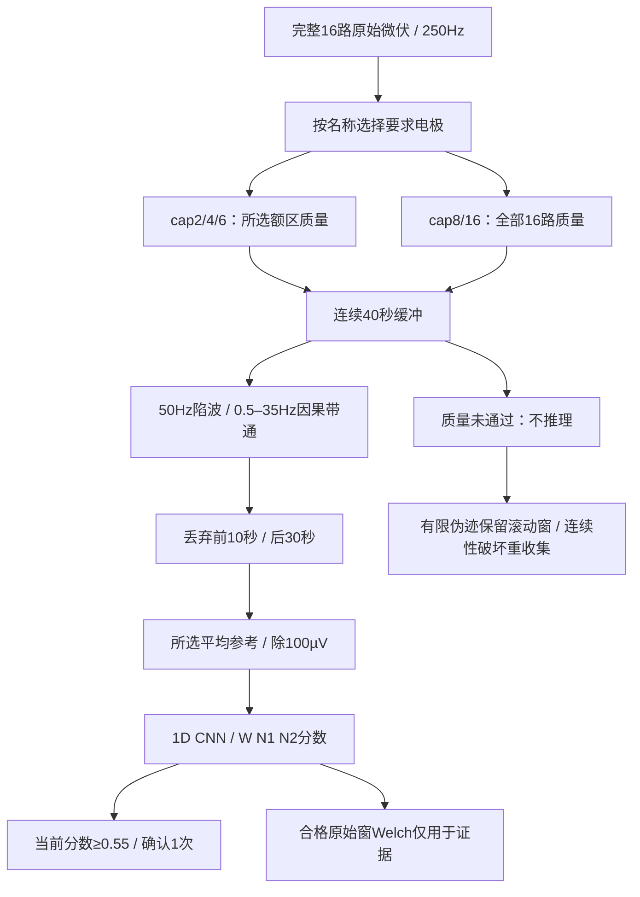

# 配图清单、结构规范与AI提示词

更新：2026-10-07，基于 `ace3a4e`。本文给出可编辑Mermaid结构和可交给图像模型的提示词，不调用外部图像服务、不上传真实EEG/音频、不代表已生成新PNG。主文档中的Mermaid是当前可直接阅读的配图。

## 使用方式与验收规则

先依据Mermaid固定节点与边界，再将AI图作为概念插图；短英文标签可避免长中文乱码，中文解释放在Markdown图注。图像模型可能漏边/错字，不可把生成图片作为API或数据契约依据。正式交付前逐边核对：16路采集≠所选输入、LIVE≠DEMO、分类≠音乐状态、生成任务≠实际播放、数字录音≠声压/临床结果。

已有 `images/architecture.png`、`eeg-to-music-concept.png`、`music-paths.png`、`waveform-pipeline.png` 由远端版本提供，本轮未修改或逐像素验收。下面可作为同名图片的新版重绘规范，也可以使用新文件名保留旧图。所有新的位图必须审核后再嵌入文档，避免把Stem保留源码误画为当前用户菜单。

## 图1：当前部署与模块边界

建议文件：`images/architecture-current.png`；用途：主文档总体架构。五块为DEVICE、LOCAL BACKEND、BROWSER、OPTIONAL REMOTE SERVICES、LOCAL EVIDENCE。

**AI提示词：**

> Create a precise technical architecture diagram, landscape 16:9, clean vector style, light neutral background, restrained blue and green accents, readable short English labels, no decorative brain anatomy. Show DEVICE with BrainFlow EEG cap and synthetic DEMO as distinct inputs. LOCAL BACKEND contains app.py acquisition thread, a bounded adaptive_web worker queue, LIVE waveform CNN, separate DEMO legacy/scripted branch, quality and music controls, session_reports. The raw 16-channel EEG splits BEFORE display cleanup: raw goes to inference, display-filtered samples go through WebSocket to BROWSER. BROWSER contains Vue control UI, two CURRENT playback choices ACE and Upload + MIDI, Web Audio and AudioWorklet final-mix recorder, report UI and experiment labels. OPTIONAL REMOTE SERVICES contains ACE-Step on loopback/tunnel 8001 and independent Demucs separator on 8002. Music proxies send audio to browser. Browser evidence and digital PCM return to local report storage. Put BabySlakh four-stem API and StemEngine in a smaller clearly marked box "Retained code, not in current App menu", not as a third current menu. Labels: W/N1/N2 are EEG classes; M1/M2/M3 are music plans. Bottom caveat: "Digital evidence, not clinical outcome or speaker SPL". No claim of randomized experiments, full raw-EEG archive or hardware timing verification. Carefully connect directional arrows; preserve asynchronous acquisition, inference and generation boundaries.

图注：主后端8000与前端5173的端口为开发默认；图中的可选远端服务需要另行部署。Stem仅保留代码，非当前菜单。

## 图2：波形模型输入与质量路径

建议文件：`images/waveform-pipeline-current.png`；用途：02/03。

**AI提示词：**

> Design a scientific signal-processing flow diagram, landscape 16:9, flat vector, white background, concise English labels and clear numbered stages. Start with "Raw CAP16, 250 Hz, microvolts". Show explicit frontal montages: cap2 Fp1 Fp2; cap4 Fp1 Fp2 F3 F4; cap6 adds F7 F8. Separate legacy cap8/cap16 lane labeled "all-16 clean contract". Show 40-second contiguous buffer, quality screening, 50 Hz notch and causal 0.5–35 Hz bandpass, discard 10-second context, selected-channel average reference, divide by 100 µV, 1D CNN, W/N1/N2 scores. Show redirection for failed quality: "No new classification", finite artifact windows roll forward; nonfinite/discontinuous input recollects. Add small diagnostic branch from qualified raw window to Welch alpha/theta/beta, explicitly "Evidence only, NOT CNN input features". Timing caption: "First score about 42 s, updates every 6 s; current gate 1 confirmation, score floor 0.55". Mark uncalibrated scores and hardware validation pending. Do not show YASA or spectral heuristic as a LIVE fallback, no medical accuracy claim.

图注：保留40秒缓冲并不表示当前窗口有效；参数以当前配置为准，不是永远固定的实验协议。

## 图3：音乐路径与MIDI边界

建议文件：`images/music-paths-current.png`；用途：04。

**AI提示词：**

> Create a comparative music-processing architecture graphic, wide 16:9, clear vector lines and minimal icons. Place EEG classes W/N1/N2 above separate music states M1/M2/M3. Use TWO large lanes labeled "Current App: ACE" and "Current App: Upload + MIDI". ACE lane: style + music-state description -> text generation OR uploaded reference -> Demucs non-vocal accompaniment -> ACE cover -> downloaded whole audio -> Web Audio loop and 1.5 s crossfade. Add separate side tool "ACE extract: original reference -> one requested stem -> preview/download", not connected to automatic four-stem mixing. Upload lane: local WAV normalization -> background playback + separately generated symbolic notes -> 16-beat code clock -> oscillator preview; annotate "No automatic original-song key/beat detection". At bottom add smaller dashed-outline concept box "Retained BabySlakh code: aligned four stems -> gain / lowpass control -> 3 s ramps / 1 s loop overlap; NOT mounted in current App". Distinguish changing a whole song, mixing existing stems, and generating additional MIDI. Add: "No proof of artistic or sleep superiority". Do not depict current four-stem input as automatic melody rewriting, do not show compulsory all-instrument split or perfect vocal removal.

图注：四轨控制角色不保证真实乐器同名；代码的16拍时钟不自动对齐原曲节拍，参数渐变不保证听感无缝。

## 图4：会话证据、N2终点与实验标签

建议文件：`images/session-evidence-current.png`；用途：06。

**AI提示词：**

> Create an evidence lifecycle diagram, landscape 16:9, professional flat vector infographic. Start -> local report UUID and acquisition metadata -> classified/quality window events with sequence -> automatic stop after two different valid LIVE N2 window events OR manual/error end. Emphasize overlapping 30 s windows updated every 6 s: "Not two independent 30 s epochs, not clinical sleep latency". Parallel browser lane: instrumented Web Audio output -> AudioWorklet stereo float32 PCM -> browser events + WAV upload -> local JSON/WAV store. Analysis box: 1 s RMS dBFS, sample peak, clipping, PSD centroid, >=8 kHz ratio and jump candidates. Unavailable items explicitly gray text: LUFS, true peak, BPM/key/chords, speaker latency, ear SPL. Trace links sequence and nearby audio as observational association, ACE provenance may be unavailable. Final UI: report download, manual anonymous participant/condition/ratings, group means and within-participant differences, CSV. Put condition labels fixed/sham/closed_loop in "Manual labels only, do NOT control playback". Note recorder memory/events limits, possible partial upload, no full raw-EEG archive. No p-values, causal claims or cure symbols.

图注：报告指标是数字输出风险筛查；标签与评分输入存在不等于已执行随机化、盲法和伪闭环实验。

## 图5：源码文件分层阅读图

建议文件：`images/code-map-current.png`；用途：07文件索引。

**AI提示词：**

> Produce a clean repository navigation diagram, landscape 16:9, monochrome with one accent, short labels, no tiny exhaustive file list. Four columns: frontend UI/components, frontend audio/evidence, local backend routes/workers, offline training/legacy tools. Place App.vue, AutomaticAcePanel, AdaptiveMusicPanel, SessionReportPanel, ExperimentAdmin in UI; liveClassification, modelChannels, adaptiveEngine, sessionEvidence and finalMixRecorder in browser runtime; app.py, adaptive_web.py, waveform_classifier.py, ace_step.py, session_reports.py and music_choices.py in backend; frontal/CAP training and legacy src/anphy_sleep CLI in offline tools. Mark remote_audio_separator as standalone remote service, and StemMusicPanel/stemEngine as retained unmounted feature. Use arrows to show import/call responsibility, not clinical efficacy. Caption "Code map: current ace3a4e, 2026-10-07". Do not imply all offline modules are web routes.

完整逐文件说明以 [07代码文件职责索引](detail/07-code-file-guide.md) 为准；示意图只用于导航。
